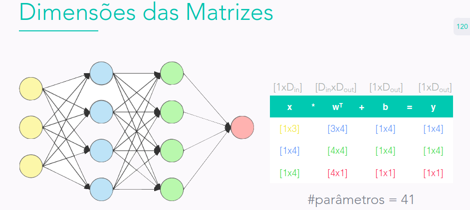

# Notas Curso Manual Prático do Deep Learninig @ Arnaldo Gualberto

### Perceptron:
- Modelo mais básico de NN.
- Composta por apenas 1 neurônio.
- N entradas e 1 saída.
- Sua função de ativação é a step function. Retorna o ŷ como 1 quando a entrada é positiva, e 0 quando a entrada é nengativa.
- Por definição é um **classificador binário linear**.
- Ele pode ser adaptado para regressão linear.
- Só resolve problemas lineares ou linearmente separáveis
- Perceptron aprende através da perceptron rule (não gradiente descendente). Ele utiliza um modelo linear simples para separar duas classes de dados através de uma linha de decisão, ajustando os pesos dos dados de entrada até que o modelo possa corretamente classificar a maioria dos exemplos apresentados durante o treinamento.
- Aprendizado online (passando amostra por amostra).
- O perceptron aprende pela atualização dos pesos a partir das entradas amostra por amostra.

$$ w_i = w_i + \lambda (y_i - \hat{y}_i) x_i $$

$$ b_i = b_i + \lambda (y_i - \hat{y}_i)  $$

### Adaline:
- adaptive linear neuron
- classificador binário linear
- composta por apenas 1 neurônio
- N entradas, 1 saída
- função de ativação: linear (+step)
- pode ser adaptado para regressão linear
- resolve problemas lineares
- o adaline sabe o "quanto" errou e o perceptron somente se errou ou não
- pode ser aplicado o gradiente descendente
- aprendizado online. os pesos são atualizados amostra a amostra
- aprende pela delta rule (gradiente descendente)

### Neurônio Sigmoid:
- composta por um neuronio
- n entradas, 1 saída
- função de ativação sigmoide
- função de custo cross-entropy
- classificador binário
- introduz não lineariedade ao perceptron
- pequenas mudanças nos parametros causam pequenas mudanças na saída
- não é utilizado para fazer regerssão linear
- sabe o "quanto" errou, assim como adaline
- podemos aplicar o grandiente descendente

### Funções de ativação:
São aplicadas sempre na saída, são responsáveis por transformar uma entrada numa saída e por limitar o range da saída.

Algumas funções são:
- linear: mais simples (y=x). não limita o range de saída. usado em problemas de regressão. baixo poder de aprendizagem. não faz sentido construir uma rede com apenas funções lineares.
- sigmoid: limita o range entre 0 e 1. a saída é interpretada como probabilidade. a saída não é centrada no zero. não deve ser usado em problemas complexos. satura os gradientes (). converge lentamente. 
- tahn: limita o range entre -1 e 1. centrada no zero. versão escalonada da sigmoid. satura os gradientes, mas menos que a sigmoid.
- relu: y = max(0, x), se x for positivo entao y = x, se x for negativo então y = 0. limita o range somente no limite inferior, em zero. é a mais usada. simples e eficiente. ajuda a evitar a saturação do gradiente. o gradiente converge mais rápido que sigmoide e tahn. só deve ser usada nas camadas internas/escondidas. pode matar os neurônios.
- leaky relu: modificação da relu que multiplica o x quando menor que zero por um valor alfa. range de -infinito a +infinito. diminui a chance de matar neurônios. só deve ser usado nas camadas internas. 
- elu: saída truncada em -alfa e +infinito, modificação da relu, diminui a chance de matar neurônios, só deve ser usada nas camadas internas
- softmax: ela nao é colocada na saída, ela pega as saídas e converte pra uma faixa de valores. É colocado na ultima camada e só em problemas de classificação multiclasse. limita a saída entre zero e um e a soma das saídas é 1. Usado em 2 ou mais neurônios. Sua saída deve estar no formato OHE (por quê ?). a saída é interpretada como a confiança de uma amostra pertencer a uma classe (não probabilidade).

### Backpropagation:
- Derivada: "Força que aplica em cada entrada pra aumentar a saída.", "É uma forma inteligente de saber como deve alterar as entradas pra levemente aumentar a sua saída"
- A derivada é calculada sobre cada entrada;
- Gradiente: Vetor de derivadas das duas entradas. Ou seja, todas as derivadsa sobre as entradas concatenadas.
- Gradiente numérico: é usado quando nao sabemos calcular a derivada de alguma função. Gradiente numérico em relação a x: $df(x, y)/dx = f(x + h, y) - f(x, y)/h$. Derivada em relação a y: $df(x, y)/dx = f(x, y + h) - f(x, y)/h$ 
- Gradiente analítico: é usado quando sabemos calcular a derivada de alguma função.
- Ex.: No exemplo dado, a derivada de x foi 3 e a de y foi -2. A força pura da do x foi maior e o sinal positivo indica que alterando o valor do x pelo passo h a saída se torna maior. O inverso acontece com y, já que é negativo, alterando o valor do y pelo passo h o valor se torna menor (nesse exemplo queremos maior).
- A derivada em relação a alguma entrada por ser calculada ajustado levemente aquela entrada e observando a mudança no valor da saída.

### Padrões backpropagation:
- Porta de soma propaga o df para as entradas anteriores
- Porta de multiplicação faz a multiplicação do df com a outra porta que está derivando
- Porta max propaga o df para função com maior valor e zera a outra

### Atualização dos pesos
Em uma rede neural, o processo de ajuste dos pesos (ou parâmetros) ocorre durante o treinamento do modelo, com o objetivo de minimizar a função de perda (ou custo) associada às previsões do modelo em relação aos valores observados nos dados de treinamento.

A derivada é uma ferramenta importante no ajuste dos pesos, pois ela indica a direção e a magnitude do gradiente da função de perda em relação a cada um dos pesos da rede. A partir disso, é possível atualizar os pesos em cada iteração do treinamento utilizando um algoritmo de otimização, como o gradiente descendente, que utiliza a derivada da função de perda em relação aos pesos para ajustá-los na direção que leva à redução da função de perda.

O processo de ajuste dos pesos em uma rede neural pode ser resumido em algumas etapas principais:

- Inicialização dos pesos: Os pesos são inicializados com valores aleatórios ou pré-treinados.
- Propagação para frente (forward propagation): Os dados de entrada são propagados pela rede neural e as previsões são geradas.
- Cálculo da função de perda (loss function): A função de perda é calculada para comparar as previsões do modelo com os valores observados.
- Cálculo do gradiente da função de perda em relação aos pesos (backward propagation): A derivada da função de perda em relação aos pesos é calculada utilizando a regra da cadeia.
- Atualização dos pesos: Os pesos são atualizados utilizando o gradiente descendente ou outro algoritmo de otimização, que ajusta os pesos na direção que leva à redução da função de perda.
- Repetição do processo: As etapas 2 a 5 são repetidas várias vezes até que a função de perda atinja um valor mínimo ou até que o modelo alcance um nível satisfatório de precisão nos dados de validação.

Na atualização dos pesos, os valores de entrada são multiplicados pelo gradiente da função de perda em relação aos pesos. 

O algoritmo de otimização, como o gradiente descendente, utiliza o gradiente da função de perda em relação aos pesos para atualizar os pesos em direção ao mínimo da função de perda. Na atualização dos pesos, é utilizado um passo de aprendizado (learning rate) que define a taxa na qual os pesos são atualizados em cada iteração.

Assim, na atualização dos pesos, é calculada a diferença entre o valor atual do peso e a multiplicação do passo de aprendizado pelo gradiente da função de perda em relação ao peso. O resultado é o novo valor do peso atualizado.

### Implementando redes neurais:
- A primeira coisa que precisamos saber é o shape da matriz, número de linhas e colunas
- y = xw^T+b
- x = [1xDin], ou seja, uma amostra com quantas entredas quiser
- A mesma coisa pro y = [1xDout]. Uma linha de saída com Dout colunas;
- A dimensão dos pesso e dos bias devem ser iguais as da entrada e saída, ou seja; As dimensões dos pesso e do bias deve ser uma multiplicação de matrizes pros pesos + soma do escalar bias
- [1xDout] = [1Din]x[DinxDout]+[1xDout]
- o w ou [DinxDout] com a mesma dimensão da entrada e mesmo número de colunas da saída;
- Ex. Numa rede com 3 entradas, duas camadas escondidas com 4 neurônios cada e uma saída teremos:

[1Din]x[DinxDout]+[1xDout] = [1xDout] #y

[1x3] * [3x4] + [1x4] = [1x4] # primeira camada

[1x4] * [4x4] + [1x4] = [1x4] # segunda camada

[1x4] * [4x1] + [1x1] = [1x1] # saída

Neste exemplo teremos 41 parâmetros, que é o número total de pesos + bias
[3x4] + [1x4] = 16

[4x4] + [1x4] = 20

[4x1] + [1x1] = 5

16 + 20 + 5 = 41

### Funções de custo:
- loss = erro pra amostra
- cost = erro pro banco, df. somatório das perdas
- As funções de custo pra regressão mais comuns são MAE e MSE
- As funções de custo pra classificação binária são cross entropy
- Nas classificações multiclasse, o ouput é uma matriz multiclasse (OHE). O número de colunas é igual a quantidade de classes e o número de linha é igual ao número de amostras. As funções de custo pra classificação multiclasse são softmax + neg. log-likelihood. 

### Tipos de problema:
- Em regressão: O número de neurônios da ultima camada é igual ao número de output, a função de ativação é linear, e as funções de custo podem ser MSE, MAE, SSE...
- Em class. binária: O número de neurônios na ultima camada é 1 (classe predita), a função de ativação é sigmoid, e a função de custo é cross entropy
- Em class. multiclasse: O número de neurônios da ultima camada é igual ao número de classes do problema, a função de ativação é linear, e afunção de custo é softmax + neg. log-likelihood. OBS: Alguns frameworks colocam a softmax como função de ativação, então só usamos a neg log likelihood como função de custo.

### Inicialização dos Pesos:
- Zeros: Inicia todos os pesos com valor zero. O uso não é recomendado porquê se todos os pesos são iguais, todas as ativações também vão ser iguais. Assim, a rede se torna simétrica e a rede não aprende nada.
- Ones: Mesmo que Zeros.
- Uniforme Aleatória: Ajuda a quebrar a simetria, os valores são inicializados entre valores de 0 a 1 com a quase a mesma probabilidade de acontecer.
- Normal Aleatória: Os pesos tem média zero, com um desvio padrão. Os pesos tem valores diferentes, que ajuda a quebrar a simetria e a rede a aprender.
- Glorot Uniform: Também chamado de Xavier Uniform, esse método assim como a Uniform Aleatória, os valores vão ter quase a mesma chance de acontecer, mas leva em consideração o número de neurônios das camadas na definição do desvio padrão. Ela ajuda a quebrar a simetria e torna a convergência mais rápida e eficiente.
- Glorot Normal: Também chamado de Xavier Normal. Também é parecido com a Normal Aleatória mas com as características da glorot. Leva em consideração a quantidade de neurônios/tamanho das camadas, ajuda a quebrar a simetria, torna a convergência mais eficiênte e rápida.
- As glorot normal e uniform são os métodos de inicialização de pesos mais utilizados.

### Regularização
- Regularização L1: Cria uma rede menor capaz de resolver o problema; Tende a criar soluções esparsas (zeros); Faz seleção das features mais importantes; Pode ser difícial de estimar; **É aplicáda em casos de overfitting**.
- Regularização L2:  A ideia é criar uma rede onde nenhum atributo seja tão mais importante que os outros; Tende a diminuir e espalhar os valores dos pesos; É mais utilizada que a regularização L1; Também é chamada de weight decay; Pode ser difícil de estimar; Aplique em caso de overfitting.
- Dropout: Zera aleatoriamente a ativação de alguns neurônios em cada camada por uma probabilidade p; A ideia é treinar várias redes menores que aprendam a resolver problema com diferentes informações; **Reescale as ativações restantes restantes por 1/p**; Mais fácil de estimar; É uma das melhores técnicas de regularização; Não aplique na validação/teste!; Aplique em caso de overfitting
- Batch Normalization: Normaliza as entradas ou saídas das funções de ativação; Estima a média e o desvio-padrão da população baseada no batch (média móvel); Regulariza camadas ao invés de neurônios; Pode substituir a dropout; É uma das melhores técnicas de regularização; Cuidado na validação e teste!; Cuidado no gradient checking!
- Early Stoping: Para o treinamento quando a perda na validação deixa de diminuir (dada uma certa paciência); Evita o overfitting (mas pode ocorrer underfitting)

# Referência
- Material Manual Prático do Deep Learninig <https://github.com/arnaldog12/Manual-Pratico-Deep-Learning>
- Curso Manual Prático do Deep Learninig <https://www.udemy.com/course/redes-neurais/>
- Slides Manual Prático do Deep Learninig <https://www.icloud.com/keynote/0LZvPsaugs7uCqr4TS-keRh-g#Manual>
